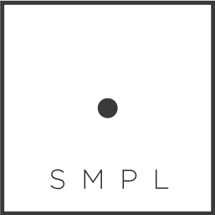

# smpl
### simplified modelling programming language
> simplifies your programming, by allowing you to code how you want. SMPL!

smpl (pronounced "simple") is a compiler which allows you to write your code the way you want. You define simple idioms that make sense to you, and use them to construct your code, then compile it down to your language of choice.

It's not just a simple compiler, because smpl makes no judgements of which language you will be targeting for your compile.  Compile it to C, Ruby, PHP, whatever, its up to you.

> smpl as that!

## Motivations
I've tried on several occasions to build my own mini-language using the compilers available on the market. I've used libraries such as [sweet.js](http://www.sweetjs.org) and [peg.js](http://www.pegjs.org) which were great, but fell short of what I was looking for. Mainly, they both suffered from the same set of concerns:
+ They are too opinionated about the target language, both forcing you into a javascript syntax to parse your results.
+ Things get exponentially complex the larger your language set becomes.

smpl aims to solve that by allowing for more general grammar definitions, as well as taking out the dependency for javascript syntax. I recommend people try some of these other solutions if smpl is not a good fit for your project.

Although our goals are very different from [sweet.js](http://www.sweetjs.org), I thought their approach to syntax makes it easier to construct these patterns-- thus, I have borrowed quite a few syntax choices from that library. Again, I definitely recommend you take a look to get an idea of what you'll be able to do here.

## Getting Started
Simply install the package globally to get the command line tool

    npm install smpl.js -g
    smpl --help

## Syntax
smpl has a very small set of helper macros which you can use to construct your patterns.
#### `pattern ( input... ) => { output... }`
Using the pattern macro,  you place the pattern you want to match in parenthesis, and place how you want it to transform in the brackets.

    pattern ( hello world ) => { console.log("hello world") }
    hello world
    //compiles to console.log("hello world")
#### `pattern name (input) => { output }`
Sometimes you want to use a pattern in another pattern. To do this you must name your pattern and use the expression variable `$name` denoted by a "$" symbol  followed by a colon `:` and the name of your pattern. you can then use that value caught by your variable in your output

    pattern name ( world ) => { world } //naive demonstration. simply being used  to demonstrate the point
    pattern ( hello $name:name  ) => { console.log("hello $name") }
    hello world
    //outputs console.log("hello world");

there are a number of built in types which you can use out the gate.
+ `lit`: matches a single literal identifier. ex. `hello` `world` `susan` `new` `var`
+ `num`: matches a number. ex. `1` ` 2` `30` `540`
+ `str`: matches a string. ex. `"hello world"` `'hello world'`
+ `op`: matches an operator. ex `+` `-` `==` `=` `*`
+ `punc`: matches a punctuator. ex `.` `;` `:` `,` `!`
+ `comment`:  right now it only matches javascript style comments. (may extend it to `#` style comments in the future) ex. `\\comment` `\* comment *\`
+ `func`: right now only supports javascript style function expressions and declarations. ex `function (){ ... }` `function name (){ }`
+ `afunc`: javascript style arrow functions. ex `(x)=>x` `(x)=>{ return x }`
+ `expr` : matches all of the above plus any patterns you define with a name.
+ `curly`: matches anything within cancelling curly braces. ex. `{ s... }` `{ { {}}{...}}`
+ `paren`: matches anything within cancelling parentheses. ex. `( s... )` `(()(...))`
+ `brack`: matches anything within cancelling square brackets. ex. `[...]` `[[],[...]]`
+ `group`: matches either curly, paren, or brack.

you can use these helpers to help build up dynamic style patterns.

    pattern hello ( hello $name:lit ) => { hello("$name") }
    pattern greeting ( $hello:hello , welcome to my $place:lit ) => { welcome($hello, $place ) }
    hello steven //compiles to hello("steven")
    hello beth, welcome to my home //compiles to welcome(hello("beth"), home)
as you can see, nested patterns compile to their own outputs once they are placed.
####` capture name ( input ) => { output }`
Along with named patterns, you can also define places where you don't want to to necessarily transform the data, merely capture something about it. Thats where the capture macro comes along. Use the above syntax to capture data to be used in a pattern later. For instance, you may want to capture all of the variable names you declare in your document, and use them in specific patterns later.

In fact, lets use that example to construct a new hello world, where the only input it will allow is the names of variables that i've declared.

    capture var ( var $name:lit ) => { $name }
    pattern ( hello $name:var ) => { hello("$name") }

    hello james // compiles to hello james
    var james = true;
    hello james //compiles to hello("james")

#### `patterns name { patterns... }`
Sometimes you wish to make a pattern class that is defined by several definitions. In this case, use the above syntax. please take note of the use of the keyword `patterns` and not `pattern` this time.

    patterns greetings {
        (hello $name:lit ) => { hello($name) }
        (welcome $name:lit ) => { hello($name) }
        (goodbye $name:lit ) => { bye($name, true) }
    }
    pattern (say $greet:greetings) => { say($greet) }
    say hello mary; //say(hello(mary));
    say welcome josh;
    goodbye mabelle;//bye(mabelle, true)

This makes it easy to make very dynamic languages with very little syntax.

#### SPECIAL MENTION: `...` The ellipses
Some patterns may require you match things in repeated succession. For these patterns use the ellipses. It denotes that you would like the pattern or token before it, to be repeated one or many times. It uses the syntax `$variable:type (delimiter)...`.

    pattern { hello $name:lit( ,)... } => { hello([$name])}
    hello world, moon, sun; //compiles to hello([ world, moon, sun ]);

you can also change the delimiter in the output if you'd like, by using the `()...` syntax in the output.

    pattern { hello $name:lit( )... } => { hello([$name(,)...])} //notice that whitespace as a delim is marked by an empty paren

    hello world moon sun; //compiles to hello([ world, moon, sun ]);

## Command Line Tool
Once you have constructed your documents, use the command line tool to compile it into your target language.  you start with prompt `smpl`
#### smpl compile [dir]  [options]
compile is your entry point. you can simply use the `smpl compile` command along with input glob to parse your files.

    $  smpl compile ./example/*.example

optionally you can use `c` or `p`

    $  smpl c ./example/*.example

this will simply compile your file into a javascript file in the same directory.  You can also optionally specify different options to alter your results.

#### options
##### --extension ||  -e
You can use the extension's flag to change the file type of your outputs

    $   smpl c ./example/*.example  -e .cpp

will output a c++ files from your .example's
##### --output || -o
Specify an output directory

    $   smpl c ./example/*.example -o ./build

##### --module || -m
Sometimes you may want to separate your patterns from your working documents. If you have done that, you can specify the document with your patterns using the `-m` flag

    $   smpl c ./example/*.example -m patterns.js -o ./build

##### --concat || -c
if you would like your output to be in a single file, use the `-c` flag to join them together.

    $   smpl c ./example/*.example -c example.js -o ./build

##### --watch || -w
If you would like to watch a file or directory, place the `-w` flag in the query.

        $   smpl c ./example/*.example -o ./build -w

#### smpl --help
Use the help flag after any argument to get an overview of all of the arguments you can use.

    $    smpl --help

    Invalid Command. Showing Help:

    Commands:

    help [command...]        Provides help for a given command.
    exit                     Exits application.
    compile [options] <dir>  Parses the files at the given directory (node glob)

## Package Commands
You can optionally add commands to your package.json file. smpl will read your package for the `"smpl"` object, and parse any expressions that you make a key for.

    "name":"my_package",
    ...
    "smpl": {
            "examples": "c ./examples/**/*.smpl"
    }

This will allow you to call commands without the need for the long query strings

    $   smpl examples
    //same as
    $   smpl c ./examples/**/*.smpl

## Be Aware
This is still in Pre-Alpha stage. I literally built this in a couple days, so i wouldn't recommend using it in production just yet. I haven't even written any tests for it yet. So, use at your own risk.

That being said, contribute to your hearts desire, I am always open to new ideas and ways in which we can improve this library.  Drop any issues, updates, ideas, etc. in the issues of the git repo and I'll try my best to address it in a timely fashion.

## Roadmap for v0.1.0
+ Add Support for SourceMaps
+ Allow for "Group" captures in patterns
+ Allow For "Grouped" captures in output expressions
+ Allow for "Grouped" Ellipses in patterns
+ Allow for "Grouped" Ellipses in output expression
+ ~~Add Support for Packaged Commands~~
+ Make more in depth examples for different specific domains
+  Command Line argument for outputting to terminal
+ Documentation for `required` version of package
+ Condense core file size
